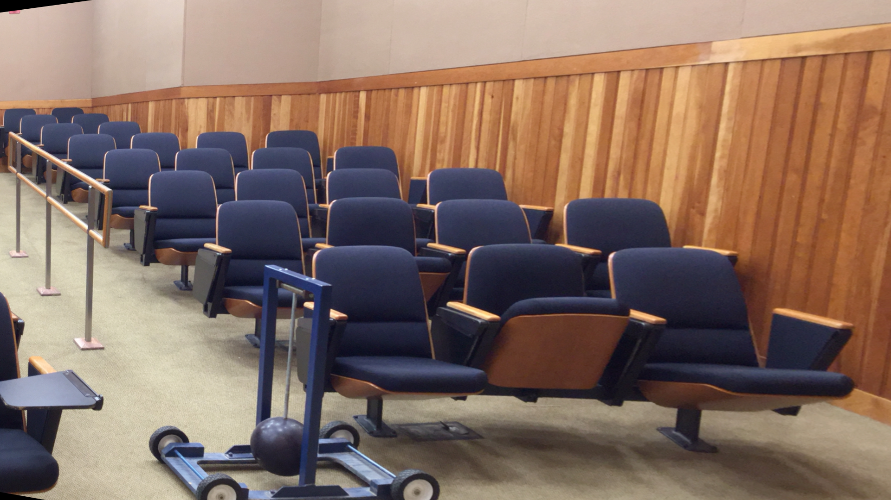
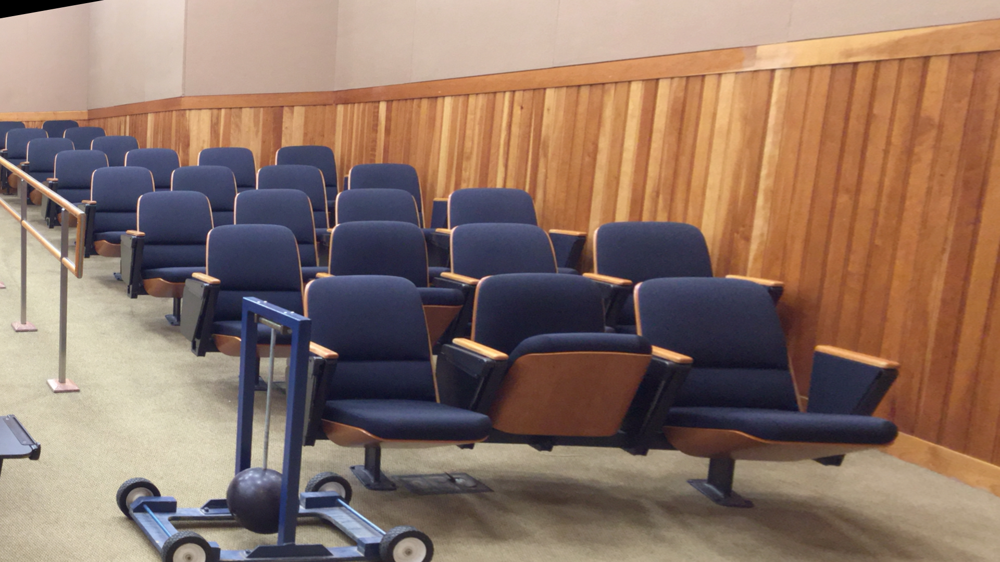
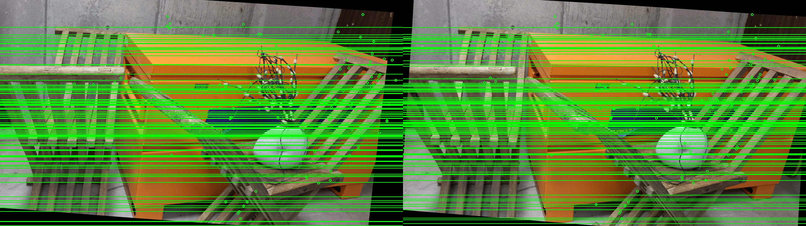
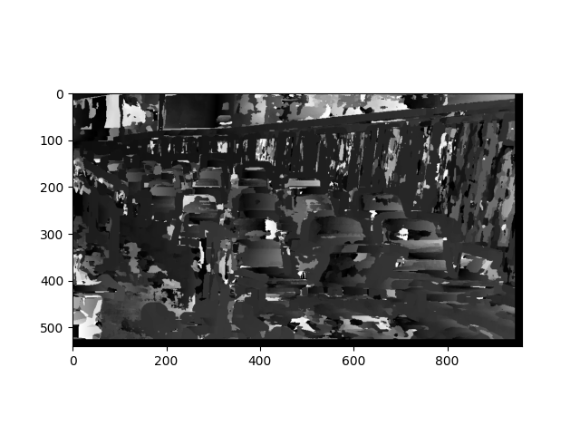
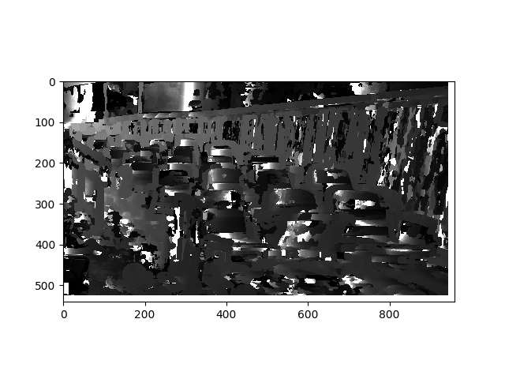
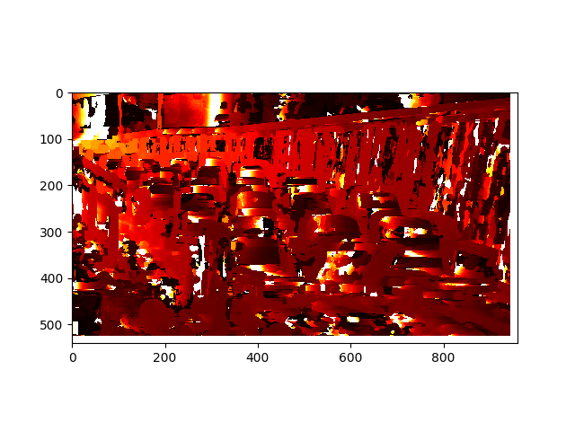

# Depth-estimation-Stereo-Images

This repository implements how to compute depth from stereo images. This is being tested on three different datasets, each containing two images of the same sceanrio but different camera angles. The baseline of the stereo setup is given.

 

## Run Instructions
```
python depth.py
```

## Feature Matching
For feature matching, we first need to locate features.
Here, SIFT (Scale Invariant Feature Transform) is used. This
detector is scale and rotation invariant. The algorithm is stated
below:
1) Convert images into grayscale.
2) Compute SIFT features for both the images.
3) Use Brute Force matcher to match the features. It uses L2
NORM distance for the same.
4) Sort the matches in ascending order of least distance and
for this project purpose only 150 matches were used.
5) Inbuilt function of cv2.BFmatcher.match gives list of ob-
jects. All points were collected from this object.


## Calculation of Fundamnetal Matrix using RANSAC
We use 8 point algorithm to estimate fundamental matrix.
The algorithm is stated as follows:
1) From the matches that are computed, 8 pairs are taken to
estimate initial fundamental matrix.
2) Before computing initial F matrix, we normalize image
coordinates and compute is done using equations.

3)All of the pairs from both the images are tested against
this fundamental matrix x ′ ∗ F ∗ x T and error was computed.

4)If the error is below some threshold value then that point
pair will be inlier and corresponding Fundamental matrix will
be considered as good.

5) The above steps were repeated for 1000 iterations and
outliers were discarded.

## Estimation of Essential Matrix
If we have calibrated cameras, we can get essential matrix
from which we can easily estimate pose.

## Estimation of Camera Pose
The Essential matrix is composed of Rotation and
Translation of camera. If we decompose Essential matrix
using singular value decomposition then we get four camera
pose configurations.

## Stereo Rectification
To compute disparity, we need to have both the images in
the same plane so that rotation does not come in to picture.
To accomplish this, we will rectify the image pairs and also
verify that they are coplanar by drawing epipolar lines. If
epipolar lines are parallel then they are considered as coplanar.
Inbuilt function of cv2.stereoRectifyUncalibrated() is used to
get homography matrices of both the images.


## Correspondence
The rectified images are available, and for each corresponding pixel on the epipolar line,
we will search for the same in another image. Here, block
matching algorithm is used where a fixed window is selected
and slided over in the other image epipolar line and Sum of
Sqaured Distances is computed.

## Disparity


## Depth


